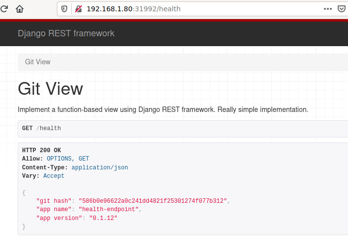

# health-endpoint
Return health status as an API endpoint

## Requirements

 * docker (optional)

 * kubernetes (optional)

 * Python 3 (3.8 recommended)

 * Django >= 3.0

 * DjangoRestFramework

## Executing unit tests

~~~~
$ python3 manage.py test
Creating test database for alias 'default'...
System check identified no issues (0 silenced).
...
----------------------------------------------------------------------
Ran 3 tests in 0.020s

OK
Destroying test database for alias 'default'...
~~~~

## Start the server

Note that TCP port 8000 is used (assumes it is not already in use):
~~~~
# change directory into the cloned repository
$ cd health-endpoint
$ python3 manage.py migrate # create SQLLite DB
$ python3 manage.py runserver 0.0.0.0:8000
~~~~

## Building docker container (optional)

~~~~
$ git clone https://github.com/ozacas/health-endpoint.git
$ cd health-endpoint
$ docker build deploy
$ export RELEASE=ozacas/health-endpoint:v0.1.8
$ docker tag `docker images -q | head -n 1` $RELEASE
~~~~

## Publish to eg. docker hub (optional)

Note container must have been built by the above step before this:
~~~~
$ docker push $RELEASE
~~~~

## Running docker container

~~~~
$ docker run -p 8000:8000 $RELEASE
~~~~
After a few seconds for the container to start, you can browse to the [health API page](http://localhost:8000/health) or invoke the API endpoint using curl(1):

~~~~
$ curl --header "Accept: application/json" http://localhost:8000/health
{"git hash":"823428e668bca17fcaf59333f05f619f35e8fab4","app name":"health-endpoint","app version":"v0.1.8"}
~~~~

## Running locally using docker (optional)

~~~~
$ docker run -p 8000:8000  `docker images -q | head -n 1`
Watching for file changes with StatReloader
Performing system checks...

System check identified no issues (0 silenced).
February 06, 2021 - 08:12:22
Django version 3.1.6, using settings 'health.settings'
Starting development server at http://0.0.0.0:8000/
Quit the server with CONTROL-C.
~~~~

## CI/CD using Github Actions

Perform the following tasks on each git push:
 * run unit tests
 * perform semantic versioning and git tag
 * run flake8 and lint checks
 * push to docker hub

Results of the CI/CD pipeline can be [viewed at github.com](https://github.com/ozacas/health-endpoint/actions?query=workflow%3A%22Validate+tree%22)

## Deployment on a kubernetes cluster (Raspberry PI4 K8s)

Based on the above infrastructure we can readily build a deployment for Kubernetes running on an arm64 architecture. Firstly use docker buildx to create a cross-platform image for arm64:

~~~~
# chdir to the root of the local health-endpoint repo
$ docker buildx build --no-cache --platform linux/arm64 --tag ozacas/health-endpoint-arm64:v0.1.12 --file deploy/Dockerfile.arm64 .
# and push to docker hub for kubernetes to access
$ docker push ozacas/health-endpoint-arm64:v0.1.12
~~~~

Now apply the deployment onto the kubernetes cluster, if necessary adjusting the container image:

~~~~
$ kubectl create -f deploy/kubernetes-deployment.yml
$ kubectl get deployments 
NAME              READY   UP-TO-DATE   AVAILABLE   AGE
health-endpoint   2/2     2            2           94m
$ kubectl create -f deploy/kubernetes-service.yml 
service/health-endpoint created
~~~~

Now we should be able to browse to the service from outside the cluster once we identify the port which the service has been made available:

~~~~
kubectl get svc
NAME              TYPE        CLUSTER-IP      EXTERNAL-IP   PORT(S)          AGE
health-endpoint   NodePort    10.105.241.46   <none>        8000:31992/TCP   46s
kubernetes        ClusterIP   10.96.0.1       <none>        443/TCP          106d
~~~~

In this case, we will find the service on TCP port 31992. So the full URL becomes a node IP combined
with this port eg. for my k8s cluster http://192.168.1.80:31992/health

Browsing to this location yields:

As expected two replicas for this (admittedly contrived) example are running:

~~~~
$ kubectl get deployment health-endpoint
NAME              READY   UP-TO-DATE   AVAILABLE   AGE
health-endpoint   2/2     2            2           105m
~~~~

Job done.
